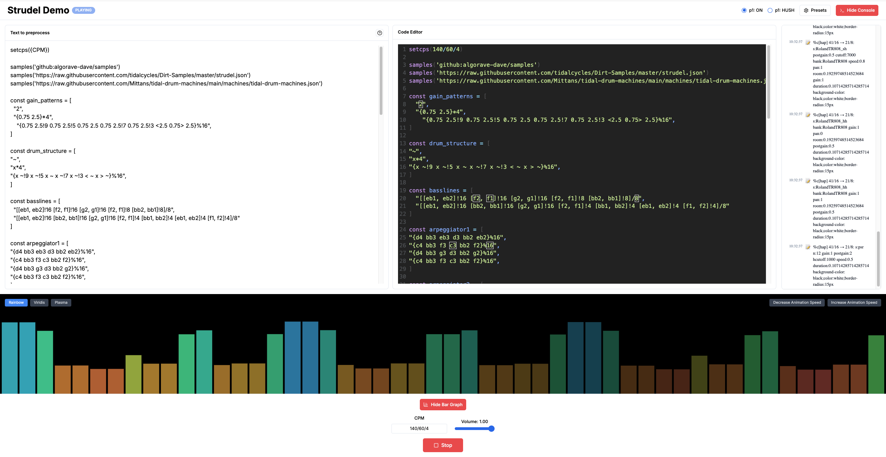
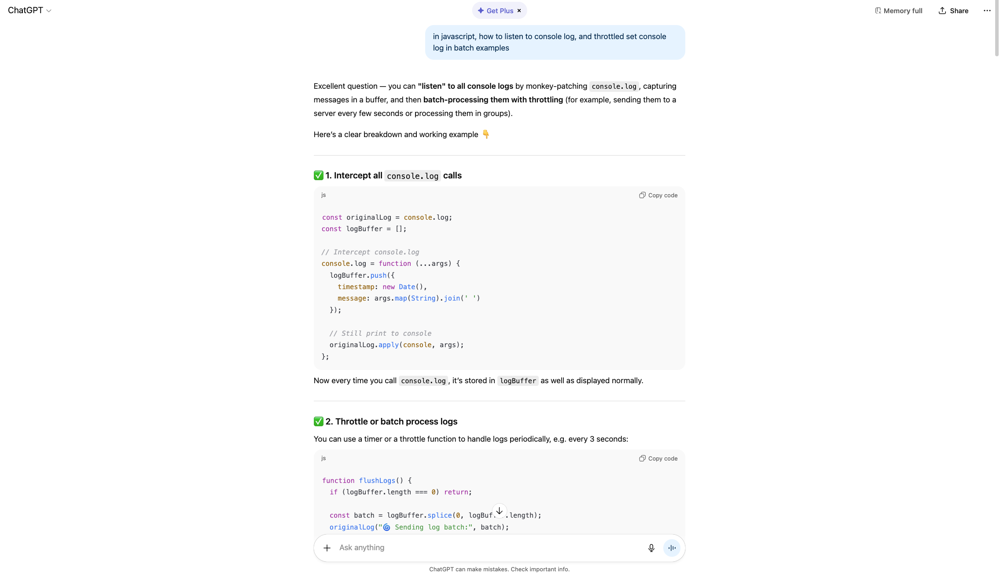

# Strudel Reactor - Assignment 2 Web tech



## Student Details

Name: WEEI WAAI KHOR (Delvin) <br>
Student ID: 110453086 <br>
Demo Video: [link here](https://mymailunisaedu-my.sharepoint.com/:v:/g/personal/khowy006_mymail_unisa_edu_au/IQAoWR4C1p4BSYw86smYzqQjAXeWNgmh5_jYSGQYPcjD8_g?nav=eyJyZWZlcnJhbEluZm8iOnsicmVmZXJyYWxBcHAiOiJPbmVEcml2ZUZvckJ1c2luZXNzIiwicmVmZXJyYWxBcHBQbGF0Zm9ybSI6IldlYiIsInJlZmVycmFsTW9kZSI6InZpZXciLCJyZWZlcnJhbFZpZXciOiJNeUZpbGVzTGlua0NvcHkifX0&e=XXp3gt) - only user with unisa account can access

## Setup

1. Clone the repository:

   ```bash
   git clone https://github.com/delvin02/strudel_reactor.git
   cd strudel_reactor
   ```

2. Install dependencies:

   ```bash
   npm install
   ```

3. Start the development server:
   ```bash
   npm start
   ```

The app will open in your browser at [http://localhost:3000](http://localhost:3000).

## Architecture

### Technology Stack

- **React 19**: Frontend framework
- **Strudel**: Live coding language for music (`@strudel/web`, `@strudel/repl`)
- **D3.js**: Data visualization library for bar graph
- **Tailwind CSS**: Utility-first CSS framework
- **Radix UI**: Accessible component primitives
- **LocalStorage API**: Client-side preset persistence

### Project Structure

```
src/
├── components/
│   ├── BarGraphPanel.js      # D3.js animated bar graph visualization
│   ├── ConsoleLogView.js      # Console log display component
│   ├── ControlPanel.js        # Play/Stop controls, CPM, Volume
│   ├── Header.js              # Header with mode toggle and presets
│   ├── PreprocessView.js      # Text input with JSON paste support
│   ├── StrudelEditor.js       # Strudel code editor wrapper
│   └── ui/                    # Reusable UI components (shadcn)
├── hooks/
│   ├── useStrudel.js          # Strudel editor initialization and control
│   ├── useTextProcessor.js    # Text processing and hush mode logic
│   └── usePresets.js          # Preset management with localStorage
├── lib/
│   └── utils.js               # Utility functions (color scales)
├── App.js                     # Main application component
├── console-monkey-patch.js   # Console log interception
└── cors-redirect.js           # CORS proxy configuration
```

### Data Flow

1. **Text Input**: User enters Strudel code in `PreprocessView` with `{CPM}` and `{VOLUME}` placeholders
2. **Text Processing**: `useTextProcessor` hook processes text, replacing placeholders with actual values
3. **Code Evaluation**: Processed code is sent to Strudel editor via `useStrudel` hook
4. **Playback**: Strudel evaluates and plays the code through Web Audio API
5. **Log Capture**: Console logs are intercepted via monkey patching and displayed in `ConsoleLogView`
6. **Visualization**: Audio parameters from logs are parsed and visualized in `BarGraphPanel` using D3.js

### Key Hooks

- **`useStrudel`**: Manages Strudel editor lifecycle, initialization, play/stop, and code updates
- **`useTextProcessor`**: Handles text state, hush mode, and placeholder replacement
- **`usePresets`**: Manages preset CRUD operations with localStorage persistence

### State Management

- React hooks (`useState`, `useEffect`, `useCallback`, `useRef`) for component state
- LocalStorage for persistent preset storage
- Refs for performance optimization (throttled console logs, D3 data references)

## Features

### Core Functionality

- **Text Preprocessing**: Edit Strudel code with dynamic placeholders (`{CPM}` and `{VOLUME}`) that are replaced with actual values in real-time
- **Hush Mode Toggle**: Switch between `p1: ON` and `p1: HUSH` modes to control pattern visibility
- **Live Code Editor**: Integrated Strudel code editor with syntax highlighting and real-time evaluation
- **Play/Stop Controls**: Start and stop Strudel playback with immediate feedback
- **CPM Control**: Adjust Cycles Per Minute (CPM) with custom input field
- **Volume Control**: Adjust volume with a slider (0.0 to 1.0)

### Preset Management

- **Save Presets**: Save current code, CPM, and volume settings with custom names
- **Load Presets**: Load previously saved presets with one click
- **Delete Presets**: Remove unwanted presets from storage
- **JSON Paste Support**: Paste preset JSON directly into the text area for automatic conversion
- **LocalStorage Persistence**: All presets are saved to browser localStorage

### Visualization & Monitoring

- **Real-time Console Logs**: Capture and display console output from Strudel execution
- **Animated Bar Graph**: D3.js-powered visualization showing audio parameters (gain, postgain, hcutoff, speed, duration)
  - Multiple color schemes: Rainbow, Viridis, Plasma
  - Adjustable animation speed
  - Real-time waveform visualization
- **Playback Status**: Visual indicator showing current playback state (Playing/Idle)

### User Interface

- **Responsive Design**: Works on desktop and mobile devices
- **Modern UI Components**: Built with Radix UI and Tailwind CSS
- **Toggle Views**: Show/hide console view and bar graph panel
- **Help Dialog**: Instructions for pasting preset JSON

## AI Assistance

### Console Log Throttling

AI assistance was used to implement the console log throttling feature



This optimization ensures that the console log viewer remains responsive even when Strudel generates a high volume of log messages during playback.

## Credits

### Music Presets

The default preset included in this application uses the following music:

- **"The Rhythm Of The Night"** (Work In Progress)
  - Original song by: **Corona**
  - Strudel script by: **eeefano**

This preset is included in `usePresets.js` as a default example and is used with permission for educational purposes.
